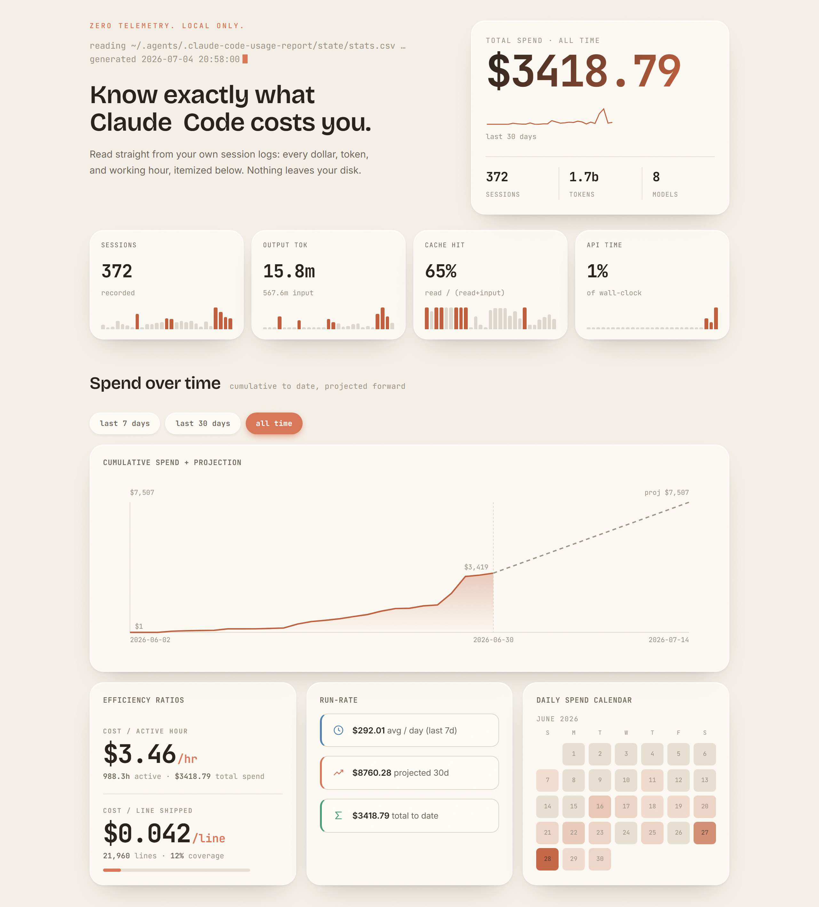
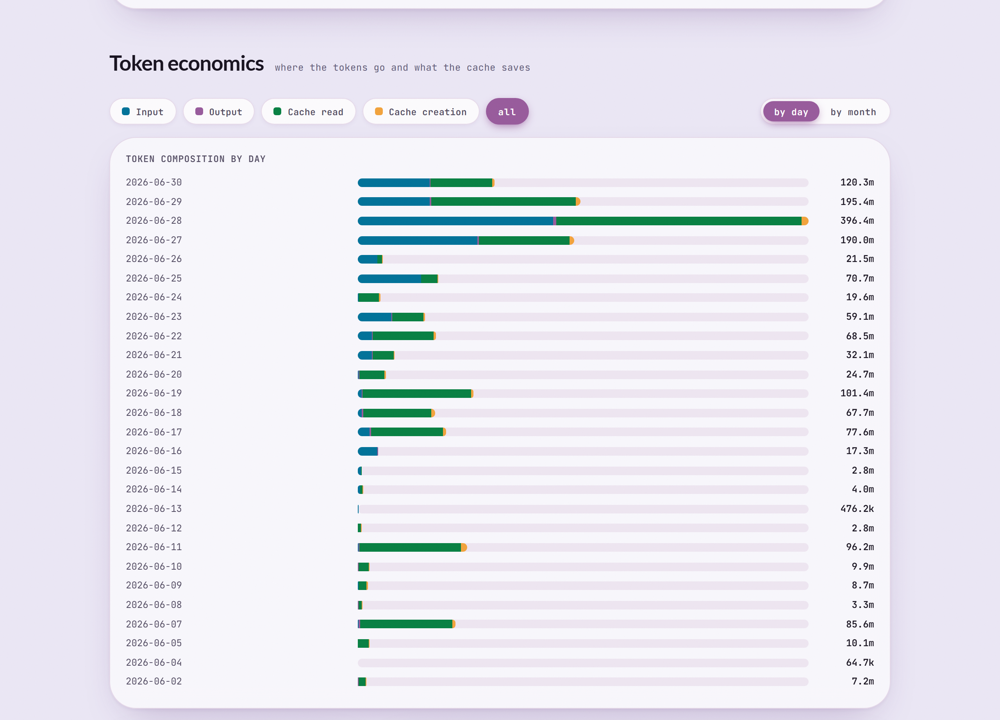
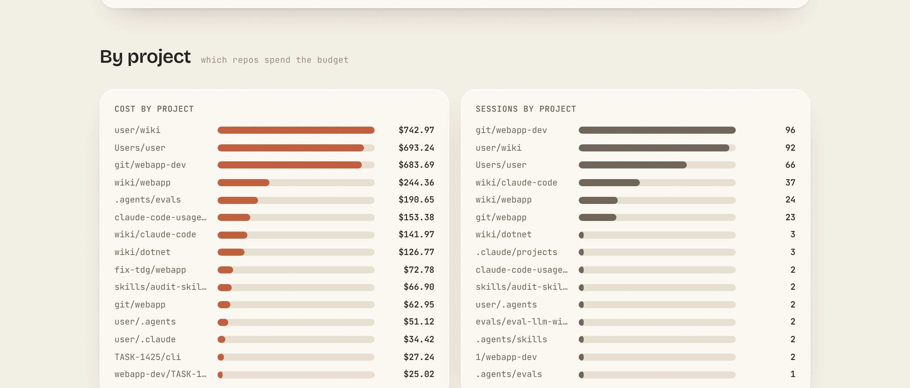

# claude-code-usage-report

Generate an interactive **Claude Code Usage Report** — session cost, token usage, efficiency, and usage patterns — from local session data. Self-contained HTML, no external libraries, runs entirely on your machine.

Data is read from `~/.agents/.claude-code-usage-report/state/stats.csv`, populated automatically by a `SessionEnd` hook. Nothing leaves the machine.

## Report at a glance

Hero KPIs, cumulative spend + projection, and a daily-spend calendar:



Token economics — input / output / cache-read / cache-creation composition by day:



Cost and sessions broken down by project:



📄 **[Full interactive example report](assets/example-report.html)** — day/month toggle, date-range filter, solo/deselect legend pills, live re-aggregation. Open in a browser. (All data anonymized.)

The example is rendered from a committed anonymized fixture, `assets/example-stats.csv` — no local session data. Regenerate it (and the screenshots above) after any design/render change:

```sh
node scripts/render-example.mjs      # example-report.html from the fixture
node scripts/screenshot-example.mjs  # refresh the 3 screenshots (needs playwright-core + chromium)
```

## What it shows

- **Burn highlights** — top 3 (of 4 candidate) reasons your tokens burned in the selected range: heavy-session concentration, outlier sessions vs. your baseline, context compactions, long/high-turn sessions. Client-side, reacts to the 7d/30d/all range picker like every other section.
- **Spend** — total, $/hour, $/line, run-rate + 30-day projection, cumulative curve, daily calendar heatmap.
- **Token economics** — input / output / cache-read / cache-creation composition per day; cache-hit ratio.
- **Efficiency** — per-session cost, $/hour, $/line (gated at 5% line coverage).
- **Rate-limit utilization** — 5h / 7d windows over time, weekends shaded (Claude Code v2.1.80+, Pro/Max oauth only).
- **Usage patterns** — when you work (day/hour heatmap), sessions table, by-project and by-model breakdowns.

## Quick start

```sh
# One-time install: writes the SessionEnd hook + creates dirs (see INSTALL.md)
node <SKILL_DIR>/scripts/stats.mjs install --with-statusline

# Render + open the report
node <SKILL_DIR>/scripts/stats.mjs report
```

Live cost/duration/context capture requires a statusline that writes its raw JSON payload to `~/.agents/.claude-code-usage-report/state/cost-state/<session_id>.json`; `--with-statusline` installs a cross-platform one. Without it, the report still renders from transcripts (cost/duration/rate-limit fields blank until a statusline is wired).

## Scope

This skill **collects and visualizes**. Deciding *what new metrics to add* belongs to the sibling **`claude-code-usage-report-suggestions`** skill; the report's "Usage roadmap" section is sourced from it.

See `SKILL.md` for full mechanics and `INSTALL.md` for install details.
